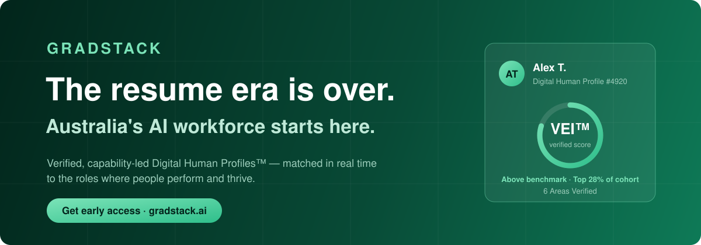

  

Gradstack is a trusted ecosystem and home to the first **Modern Hiring Standard** in Australia. We measure and verify the capability, skills, and AI fluency of early career talent, so hiring stops running on high-volume applications and gut feel. This is a place built for companies who want proof, not guesswork, instantly matched to early career talent who are suitable and a verified workforce fit.

**Come experience the standard with us.**

 

| **75%** | **1 in 4** | **Tripled** | **2027** |
| :---: | :---: | :---: | :---: |
| of applications receive zero employer response | applicants projected to be AI-generated by 2028 | demand for AI-skilled workers since 2015 | National launch: coming soon |
| *The Interview Guys, 2025* | *Gartner, 2024* | *National AI Plan, citing Bratanova et al. 2025* | |

---

## The AI workforce needs a better standard of hiring.

Resumes are self-reported. Credentials are static. Nobody checks whether AI wrote the application or the person did. Employers are asked to trust claims nobody has verified. That's not a skills gap. **It's a trust gap.**

| | The problem | Why it matters |
| :---: | --- | --- |
| **01** | **Self-reported resumes.** Anyone can write anything on a resume. Nothing gets checked until the interview, if it gets that far. | **75%** of applications receive zero employer response |
| **02** | **Static credentials.** A degree shows what someone studied. It says nothing about what they can do today. | **39%** of core job skills will change by 2030 |
| **03** | **Unverified AI use.** AI can write applications, cover letters, even interview answers now. Nothing checks who actually did the work. | **1 in 4** applicants projected to be AI-generated by 2028 |
| **04** | **No shared standard.** Every employer judges capability differently. Every university measures outcomes differently. There's no common language for verified skills and human capability. | **75%** of employers cannot find the talent they need |

## Not a job board. Not a credential checker. The Workforce Activation Layer.

Job boards move volume. Credential checkers confirm a piece of paper. Neither was built for the graduate who studied vocationally, the career changer starting over, or the self-taught talent with no degree to show for it.

Gradstack activates early career talent from every pathway (university, vocational, self-taught, career change, return to work) into the AI-native workforce, through verified human capability. We're proud to stand as a signatory of the NSW Government's 20% Alternative Pathways Pledge, backing Australia's shift toward hiring on proof, not background.

This is how Australia's talent stops being invisible and becomes **verified, visible, and activated.**

## How it works

Every skill starts as a claim. Gradstack verifies it in a **Digital Human Profile (DHP®)**, then matches only proven skills to **Workforce Seats®**.

<table>
<tr>
<td width="33%" valign="top">

### 01 · Build
**Candidate builds skills**

At uni, TAFE, on the job or self-taught. Until it's verified, it's only a claim.

</td>
<td width="33%" valign="top">

### 02 · Verify
**Verified in their DHP®**

Each skill is checked against evidence: assessments, references and confirmed identity.

</td>
<td width="33%" valign="top">

### 03 · Activate
**Matched to a Workforce Seat®**

Only verified skills count toward a match. Self-reported claims never do.

</td>
</tr>
</table>

## People verify what's required. People make the decisions.

We don't use AI to source, screen, or decide who gets hired. AI does one thing: it matches verified capability to verified Workforce Seat® data, and turns that into real workforce insights.

Every match is built on verified evidence, and it keeps improving as more of that evidence comes in. Gradstack is your trust and verification partner for the AI-driven workforce.

[Read our Responsible AI statement →](https://web-landing-prototype.vercel.app/responsible-ai-statement)

## GAFI® · Australia's National AI Fluency Score. Live now.

Everyone says they're "good with AI." Almost nobody can prove it. **GAFI®, the Gradstack AI Fluency Index®**, is the first verified measure of AI fluency built for the AI-driven workforce.

Not a detection tool. Not a self-rating. A real score, built on how capable someone is augmenting AI, across our five proprietary levels.

| Level | | |
| :---: | --- | --- |
| **L1** | **Aware** | understands what AI is and where it applies |
| **L2** | **Practitioner** | uses AI tools in everyday tasks |
| **L3** | **Integrator** | applies AI with judgment across real work |
| **L4** | **Strategist** | designs how AI is used across a team or project |
| **L5** | **Architect** | builds and shapes AI systems and standards |

[Learn about GAFI®](https://web-landing-prototype.vercel.app/products/gafi) · [Contact us about GAFI®](https://web-landing-prototype.vercel.app/products/gafi/contact)

## What our valued partners say

> "Gradstack's deep expertise and extensive network across companies and universities are finally bringing a huge fragmented early-careers system together, for the people it's meant to serve."
>
> **Stephen Wallace** · CEO, BeerOps

> "Gradstack has been a huge help in managing our candidate numbers, allowing us both to keep our team focused on their non-recruitment tasks, and to filter through massive application pools to secure the best graduates for our business."
>
> **Jordan Bettonvil** · Head of Graduate Program, RecordPoint

> "Natalia & the Gradstack team has guided so many of our students through their job search and her advice is invaluable. What Gradstack is building for early career talent, putting capability at the centre of how people get noticed, is exactly what the market needs."
>
> **Adam Martuccio** · Co-Founder, Holberton School

## Built for where Australia is heading.

Gradstack is aligned with the [National AI Plan](https://www.industry.gov.au/publications/national-ai-plan), and a proud signatory of the [NSW Government's 20% Alternative Pathways Pledge](https://www.nsw.gov.au/education-and-training/nsw-digital-compact/20-per-cent-alternative-pathways-pledge). Our work supports UN Sustainable Development Goals 8 and 10: decent work and reduced inequality.

| **SDG 8** | **SDG 10** |
| :---: | :---: |
| Decent work and economic growth | Reduced inequalities |

## Our ecosystem

| [Candidates](https://web-landing-prototype.vercel.app/ecosystem/for-candidates) | [Employers](https://web-landing-prototype.vercel.app/ecosystem/for-employers) | [Education Partners](https://web-landing-prototype.vercel.app/ecosystem/for-education-partners) | [Community Partners](https://web-landing-prototype.vercel.app/ecosystem/for-community-partners) |
| :---: | :---: | :---: | :---: |

## Opportunity depends on ability. Not background.

Australian partners, employers and institutions are already joining Gradstack. Join the waitlist for the 2027 platform launch, and if you want to start verifying AI fluency now, GAFI® is live today.

**[Get early access →](https://web-landing-prototype.vercel.app/signup)** · **[Build a more inclusive workforce with us →](https://web-landing-prototype.vercel.app/#waitlist)**

No spam. No AI-generated outreach. Just the real thing.

  

*Aligned with the National AI Plan · NSW Government 20% Alternative Pathways Pledge · UN SDG 8*

[Privacy Policy](https://web-landing-prototype.vercel.app/privacy) · [Terms of Service](https://web-landing-prototype.vercel.app/terms) · [Responsible AI statement](https://web-landing-prototype.vercel.app/responsible-ai-statement) · [Acknowledgement of Country](https://web-landing-prototype.vercel.app/acknowledgement-of-country)

© 2026 Gradstack. All Rights Reserved.

